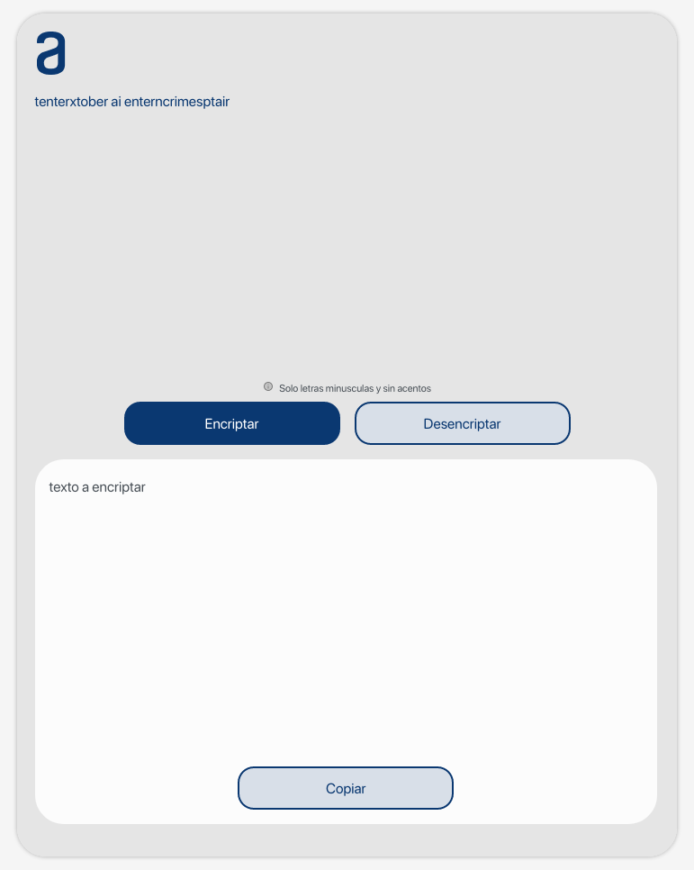

# Table of Contents

1.  [Challenge Alura : encriptador](#org90dc380)
    1.  [Contenido](#org761b774)
    2.  [Imagenes](#org9d2f7bc)
        1.  [Primera pantalla](#orgf4797a9)
        2.  [Texto encriptado](#org1e66245)
        3.  [Texto desencriptado](#org49a37ef)
        4.  [Modo tablet](#orgc516f03)
        5.  [Modo teléfono](#orgb0b099d)

# Challenge Alura : encriptador

## Contenido

-   Semana 01: Construye el encriptador con HTML y CSS
-   Semana 02: Implementando Javascript

## Imagenes

### Primera pantalla

### Texto encriptado

### Texto desencriptado

### Modo tablet

### Modo teléfono

